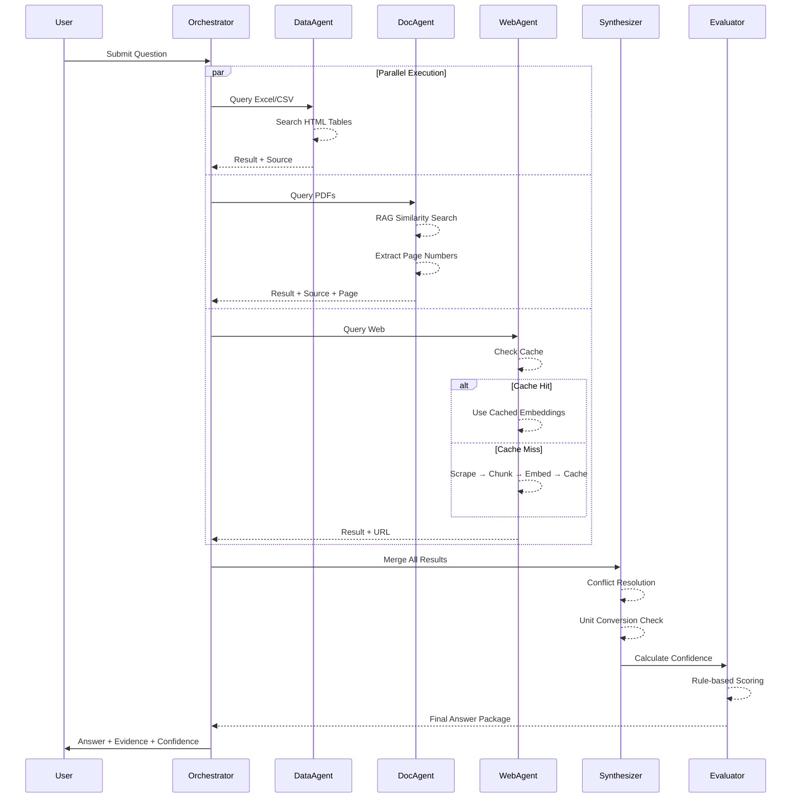
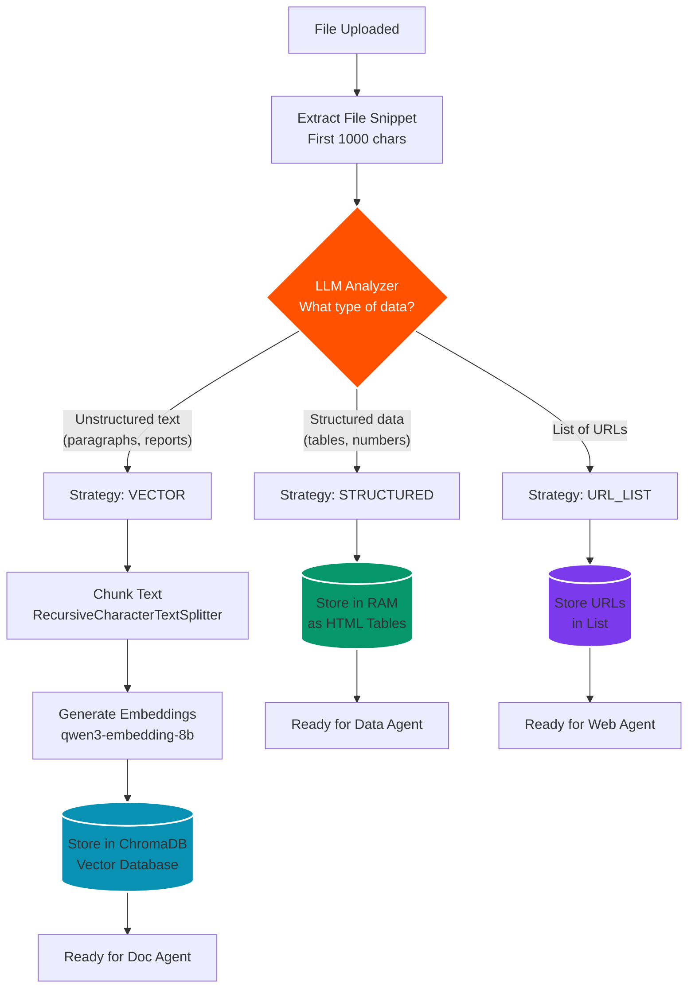
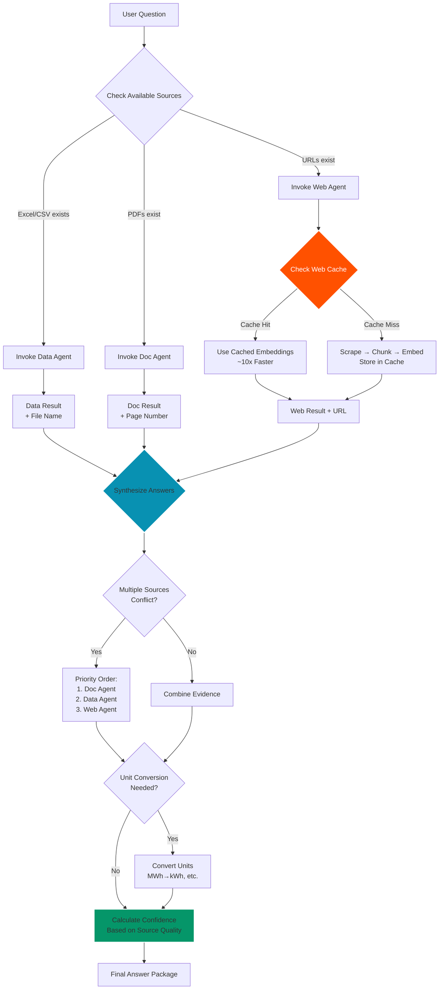
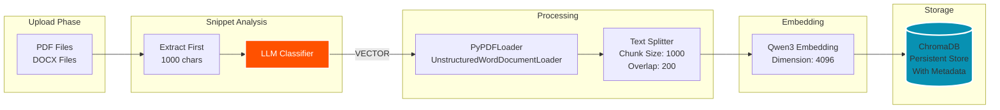
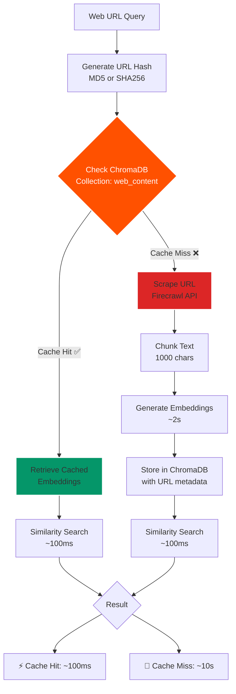

# FinSage 🏢

> **AI-Powered ESG Form Autofill System** - Intelligent multi-source data extraction and form automation using advanced agentic architecture

FinSage is an advanced AI system that automatically fills sustainability and ESG questionnaires by extracting information from multiple data sources: Excel/CSV data, PDF reports, and web pages. Built with a sophisticated multi-agent architecture featuring parallel processing, intelligent routing, and persistent caching for maximum performance and accuracy.

---

## ✨ Key Features

### 🤖 Multi-Agent Architecture
- **Data Agent**: Analyzes structured data (Excel, CSV) with intelligent unit conversion
- **Document Agent**: Extracts information from PDFs using RAG (Retrieval Augmented Generation)
- **Web Scraper Agent**: Fetches and analyzes web content with ChromaDB-based persistent caching
- **Evaluator Agent**: Calculates confidence scores based on source quality and data completeness

### ⚡ High Performance
- **Parallel Processing**: Process multiple questions simultaneously with ThreadPoolExecutor (5 workers)
- **Smart Caching**: ChromaDB-based persistent cache for web content (~10x speedup on repeated queries)
- **Real-time Metrics**: Track processing time, per-question statistics, and parallel speedup gains
- **Async Operations**: Non-blocking UI with live progress indicators

### 🎨 Premium UI
- **Dark Theme**: Beautiful KKB-branded dark mode interface with glassmorphism
- **Live Progress**: Real-time progress bars and status updates during analysis
- **Performance Dashboard**: Detailed timing statistics and speedup metrics after completion
- **Evidence Display**: Show AI confidence, sources, evidence text, and page numbers for full transparency

### 🔍 Intelligent Features
- **LLM-Based Source Detection**: Automatic file type detection and routing strategy
- **Automatic Unit Conversion**: Smart conversion (MWh→kWh, ton→kg, m³→litre, GJ→kWh)
- **Multi-Choice Support**: Handle single-choice, multi-choice, and open text questions
- **Source Attribution**: Always cite sources with file names and page numbers
- **Fallback Mechanisms**: Multi-tier search with web fallback when local data is insufficient

---

## 📁 Modular Code Structure

The project follows a clean, modular architecture with clear separation of concerns:

```
finsage/
├── app.py                          # Main Streamlit application & orchestration
├── main.py                         # CLI entry point (alternative to Streamlit)
│
├── agents/                         # 🤖 Specialized AI Agents
│   ├── __init__.py
│   ├── data_agent.py              # Excel/CSV structured data analyzer
│   ├── doc_agent.py               # PDF document RAG agent (LangChain)
│   ├── web_scraper.py             # Web scraping with Firecrawl + ChromaDB cache
│   ├── web_scraper_bs4.py         # BeautifulSoup4 fallback scraper
│   ├── web_scraper_playwright.py  # Playwright fallback scraper
│   ├── web_scraper_trafilatura.py # Trafilatura fallback scraper
│   └── evaluator.py               # Answer confidence evaluation logic
│
├── core/                          # ⚙️ Core Configuration & Utilities
│   ├── __init__.py
│   ├── config.py                  # LLM, embedding models, and app settings
│   ├── logger.py                  # Centralized logging setup
│   └── unit_converter.py          # Unit conversion logic and validation
│
├── ingestion/                     # 📥 Data Ingestion Pipeline
│   ├── __init__.py
│   └── processor.py               # LLM-based file routing & storage
│
├── utils/                         # 🛠️ Helper Functions
│   ├── __init__.py
│   ├── validators.py              # Input validation and sanitization
│   └── math_tool.py               # Mathematical operations for agents
│
├── data/                          # 📂 Data Storage
│   └── chroma_db/                 # ChromaDB vector database (PDFs + web cache)
│
├── logs/                          # 📝 Application Logs
│   └── finsage_YYYYMMDD.log
│
├── tests/                         # 🧪 Test Files
│   └── ...                        # Various test scripts and outputs
│
├── requirements.txt               # Python dependencies
├── .env                          # Environment variables (API keys)
└── README.md                     # This file
```

### Module Responsibilities

#### **`app.py`** - Main Application
- Streamlit UI initialization and layout
- File upload and URL management
- Question set loading (JSON)
- Parallel question processing orchestration
- Performance metrics tracking
- Answer synthesis and display
- Form submission and export

#### **`agents/`** - Specialized AI Agents
Each agent is designed with a specific data source in mind:

- **`data_agent.py`**: Reads structured data (Excel/CSV) stored as HTML tables in RAM
- **`doc_agent.py`**: RAG-based PDF document search using ChromaDB vector store
- **`web_scraper.py`**: Web content extraction with Firecrawl API and persistent caching
- **`evaluator.py`**: Rule-based confidence scoring (0-100) based on source quality

#### **`ingestion/processor.py`** - Intelligent File Router
- **LLM-based decision making**: Analyzes file snippets to determine optimal processing strategy
- Routes files to: `STRUCTURED` (RAM), `VECTOR` (ChromaDB), or `URL_LIST` (web links)
- Prevents duplicate processing with source tracking
- Handles PDF, DOCX, Excel, CSV, and text files

#### **`core/`** - Configuration Layer
- **`config.py`**: Centralized LLM settings (KLOUDEKS/OpenAI), embedding models, paths
- **`logger.py`**: Structured logging with file rotation
- **`unit_converter.py`**: Energy, emission, volume, and mass unit conversions

---

## 🏗️ Overall System Architecture

### High-Level System Design

```mermaid
graph TB
    subgraph "User Interface"
        UI[Streamlit UI<br/>Dark Theme]
        UPLOAD[File Upload]
        URLS[Manual URLs]
        JSON[Question Set JSON]
    end
    
    subgraph "Ingestion Layer"
        ROUTER[LLM-based Router<br/>processor.py]
        ROUTER -->|STRUCTURED| RAM[(RAM Store<br/>HTML Tables)]
        ROUTER -->|VECTOR| VECT[(ChromaDB<br/>Vector Store)]
        ROUTER -->|URL_LIST| URLS_STORE[(URL Store<br/>List)]
    end
    
    subgraph "Agent Layer"
        DATA[Data Agent<br/>Excel/CSV]
        DOC[Doc Agent<br/>PDF RAG]
        WEB[Web Scraper<br/>Firecrawl + Cache]
    end
    
    subgraph "Processing Layer"
        SYNTH[Answer Synthesizer<br/>Multi-source Merge]
        CONV[Unit Converter<br/>MWh→kWh, etc.]
        EVAL[Confidence Evaluator<br/>Rule-based Scoring]
    end
    
    subgraph "Storage"
        RAM
        VECT
        URLS_STORE
        CACHE[(ChromaDB Web Cache<br/>URL → Embeddings)]
    end
    
    UI --> UPLOAD
    UI --> URLS
    UI --> JSON
    
    UPLOAD --> ROUTER
    URLS --> URLS_STORE
    JSON --> PARALLEL[Parallel Executor<br/>ThreadPoolExecutor]
    
    PARALLEL --> DATA
    PARALLEL --> DOC
    PARALLEL --> WEB
    
    DATA --> RAM
    DOC --> VECT
    WEB --> URLS_STORE
    WEB --> CACHE
    
    DATA --> SYNTH
    DOC --> SYNTH
    WEB --> SYNTH
    
    SYNTH --> CONV
    CONV --> EVAL
    EVAL --> RESULT[Final Answer<br/>+ Confidence + Evidence]
    
    RESULT --> UI
    
    style UI fill:#1e293b,stroke:#FF5100,stroke-width:3px
    style ROUTER fill:#334155,stroke:#FF5100,stroke-width:2px
    style SYNTH fill:#334155,stroke:#FF5100,stroke-width:2px
    style RESULT fill:#059669,stroke:#10b981,stroke-width:2px
```



---

## 🤖 Agentic Architecture: Decision Making & Task Processing

### Multi-Agent Coordination Flow

The system employs a **hierarchical multi-agent architecture** where each agent specializes in a specific data source. The orchestrator (`solve_question_autofill` function) coordinates all agents and synthesizes their responses.



### Agent Decision-Making Process

#### 1. **Ingestion Router Decision (LLM-Based)**

When a file is uploaded, the `processor.py` module uses an LLM to analyze a snippet and decide the processing strategy:



**LLM Prompt (Simplified):**
```
You are a file type classifier. Analyze this file snippet and determine:
- STRUCTURED: If it contains tables, CSV data, or structured numerical data
- VECTOR: If it contains unstructured text (reports, documents, paragraphs)
- URL_LIST: If it contains a list of web URLs

File: {file_name}
Snippet: {snippet}

Output ONLY one word: STRUCTURED, VECTOR, or URL_LIST
```

#### 2. **Question Processing Decision Tree**

For each question, the orchestrator decides which agents to invoke based on data availability:



#### 3. **Answer Synthesis Logic**

The `synthesize_strict_answer` function merges results from multiple agents:

**Priority Rules:**
1. **Doc Agent** (highest priority): Internal company reports are most reliable
2. **Data Agent**: Structured data from Excel/CSV
3. **Web Agent** (lowest priority): External web sources used as fallback

**Conflict Resolution:**
- If sources disagree, the higher-priority source is used
- All sources are shown in the evidence section for transparency
- Unit conversions are applied before comparison

---

## 🔄 Document Reading Process & RAG Pipeline

### Document Ingestion Pipeline



### RAG Query Flow (Doc Agent)

When a question is asked, the Doc Agent performs the following steps:

```mermaid
flowchart TD
    START[User Question] --> EMBED_Q[Embed Question<br/>qwen3-embedding-8b]
    
    EMBED_Q --> SEARCH[Vector Similarity Search<br/>MMR Algorithm]
    
    SEARCH --> PARAMS{Search Parameters}
    PARAMS --> P1[k=5: Return top 5 chunks]
    PARAMS --> P2[fetch_k=50: Consider 50 candidates]
    PARAMS --> P3[lambda_mult=0.5: Balance similarity & diversity]
    
    P1 & P2 & P3 --> RETRIEVE[Retrieve Documents<br/>With Metadata]
    
    RETRIEVE --> META{Extract Metadata}
    META --> PAGE[Page Numbers<br/>0-indexed → 1-indexed]
    META --> SOURCE[Source File Name]
    
    PAGE & SOURCE --> FORMAT[Format Evidence<br/>"... (Kaynak: file.pdf, Sayfa 34)"]
    
    FORMAT --> LLM[LLM Synthesis<br/>gpt-oss-120b]
    
    LLM --> PROMPT{System Prompt}
    PROMPT --> RULE1[Never fabricate information]
    PROMPT --> RULE2[Always cite source + page]
    PROMPT --> RULE3[Convert units if needed]
    PROMPT --> RULE4[Return 'Not found' if no match]
    
    RULE1 & RULE2 & RULE3 & RULE4 --> ANSWER[Structured Answer<br/>+ Evidence + Source]
    
    style SEARCH fill:#0891b2,stroke:#fff,stroke-width:2px
    style LLM fill:#FF5100,stroke:#fff,stroke-width:2px,color:#fff
    style ANSWER fill:#059669,stroke:#fff,stroke-width:2px
```

**Key RAG Configuration:**
- **Embedding Model**: `qwen3-embedding-8b` (4096 dimensions)
- **Search Algorithm**: MMR (Maximum Marginal Relevance) for diversity
- **Chunk Size**: 1000 characters with 200-char overlap
- **Retrieval Count**: Top 5 most relevant chunks from 50 candidates

**Metadata Preservation:**
```python
# PyPDFLoader automatically adds metadata:
{
    "page": 33,  # 0-indexed page number
    "source": "/path/to/report.pdf"
}

# Doc Agent converts to user-friendly format:
"150 MWh energy consumption (Kaynak: Sustainability_Report.pdf, Sayfa 34)"
```

---

## 📊 Performance Optimization Strategy

### Parallel Processing Architecture

```mermaid
gantt
    title Question Processing Timeline (5 Parallel Workers)
    dateFormat X
    axisFormat %s
    
    section Worker 1
    Question 1 :0, 12
    Question 6 :12, 20
    
    section Worker 2
    Question 2 :0, 8
    Question 7 :8, 15
    
    section Worker 3
    Question 3 :0, 15
    Question 8 :15, 22
    
    section Worker 4
    Question 4 :0, 10
    Question 9 :10, 18
    
    section Worker 5
    Question 5 :0, 9
    Question 10 :9, 14
```



**Configuration:**
```python
# core/config.py
class AppConfig:
    MAX_PARALLEL_WORKERS = 5      # Concurrent threads
    AGENT_TIMEOUT_SECONDS = 60    # Timeout per question
```

**Expected Performance:**
- **Serial Processing**: 25 questions × 9s avg = 225 seconds
- **Parallel Processing**: 25 questions ÷ 5 workers = ~45 seconds
- **Speedup**: ~400% faster with parallelization

### Web Scraping Cache Strategy



**Cache Benefits:**
- **First Query**: ~10 seconds (scrape + chunk + embed + store)
- **Subsequent Queries**: ~100ms (direct embedding lookup)
- **Speedup**: ~100x faster on repeated URLs
- **Storage**: ChromaDB collection `web_content` in `data/chroma_db/`

---

## 🚀 Quick Start

### Prerequisites
- Python 3.11+
- KLOUDEKS API key (or OpenAI-compatible endpoint)
- Firecrawl API key (for web scraping)

### Installation

1. **Clone the repository**
```bash
git clone <repo-url>
cd finsage
```

2. **Install dependencies**
```bash
pip install -r requirements.txt
```

3. **Configure environment**

Create a `.env` file:
```env
# LLM & Embedding API
MIA_API_KEY=your_kloudeks_api_key_here
MIA_BASE_URL=https://mia.csp.kloudeks.com/v1

# Web Scraper API
FIRECRAWL_API_KEY=your_firecrawl_api_key_here
```

4. **Run the application**
```bash
streamlit run app.py
```

The app will open at `http://localhost:8501`

---

## 📖 Usage Guide

### 1. Upload Data Sources

**Sidebar Options:**
- **Upload Reports**: PDF documents, Word files, Excel sheets, CSV files
  - PDFs/DOCX → Processed into vector database (ChromaDB)
  - Excel/CSV → Converted to HTML tables and stored in RAM
- **Add Web URLs**: Click "🌐 Web Tarama Ayarları" to add URLs
  - Toggle "Crawl Mode" to scrape linked pages recursively
  - Configure depth (1-5 levels) and page limit (5-50 pages)

### 2. Load Question Set

- Upload a JSON file containing your questions
- Format example:
```json
{
  "formId": "123",
  "questions": [
    {
      "questionId": 1,
      "questionDescription": "2023 yılında toplam enerji tüketimi kaç kWh?",
      "questionType": "openText",
      "answers": []
    },
    {
      "questionId": 2,
      "questionDescription": "ISO 14001 sertifikasına sahip misiniz?",
      "questionType": "singleChoice",
      "answers": [
        {"answerId": 1, "answerDescription": "Evet"},
        {"answerId": 2, "answerDescription": "Hayır"}
      ]
    }
  ]
}
```

### 3. Generate Answers

Click **"✨ Yapay Zeka ile Formu Doldur"**

The system will:
1. ✅ Process questions in parallel (5 workers)
2. 📊 Show real-time progress with live updates
3. ⏱️ Display performance metrics upon completion
4. 📝 Fill the form with AI-generated answers + evidence

**Performance Display:**
```
📊 SORU CEVAPLAMA PERFORMANS RAPORU
⏱️ Gerçek Toplam Süre: 45.2s (butona basıştan itibaren)
📝 Toplam Soru: 25
⚡ Soru Süreleri Toplamı: 3m 45s (225s)
📊 Ortalama Süre/Soru: 9.0s
🚀 En Hızlı: 2.1s
🐌 En Yavaş: 23.4s
⚡ Paralel Kazanç: %397 daha hızlı
```

### 4. Review & Submit

- Review AI suggestions with confidence scores (0-100)
- Check evidence and source citations
- Manually adjust answers if needed
- Click **"✅ Formu Onayla ve Kaydet"**
- Download results as JSON

**Confidence Indicators:**
- 🟢 **70-100**: High confidence (strong evidence from reliable sources)
- 🟡 **40-69**: Medium confidence (partial evidence or external sources)
- 🔴 **0-39**: Low confidence (weak or conflicting evidence)

---

## ⚙️ Configuration Options

### `core/config.py`

```python
class AppConfig:
    # Performance Settings
    MAX_PARALLEL_WORKERS = 5           # Concurrent question processing
    AGENT_TIMEOUT_SECONDS = 60         # Timeout per question
    
    # Retrieval Settings
    DOC_RETRIEVAL_K = 5                # Number of chunks to retrieve
    MIN_DOC_RESPONSE_LENGTH = 50       # Minimum viable doc response
    MIN_DATA_RESPONSE_LENGTH = 20      # Minimum viable data response
    
    # Content Limits
    WEB_CONTENT_MAX_CHARS = 40000      # Max web content to process
    SNIPPET_MAX_CHARS = 1000           # File snippet for LLM analysis
    
    # Confidence Thresholds
    HIGH_CONFIDENCE_THRESHOLD = 70     # Green indicator
    MEDIUM_CONFIDENCE_THRESHOLD = 40   # Yellow indicator
    LOW_CONFIDENCE_THRESHOLD = 0       # Red indicator
```

### LLM Models

```python
# Embedding Model (4096 dimensions)
embedding_model = OpenAIEmbeddings(
    model="qwen3-embedding-8b",
    openai_api_key=API_KEY,
    openai_api_base=KLOUDEKS_BASE_URL
)

# Reasoning LLM (120B parameters)
llm_reasoning = ChatOpenAI(
    model="gpt-oss-120b",
    openai_api_key=API_KEY,
    openai_api_base=KLOUDEKS_BASE_URL,
    temperature=0,      # Deterministic for auditing
    max_tokens=4000     # Long-form answers
)
```

### Web Scraper Settings

- **Crawl Mode**: Follow links on target pages (boolean)
- **Max Depth**: How many levels deep to crawl (1-5)
- **Page Limit**: Maximum pages to scrape per URL (5-50)

---

## 🧪 Testing

Run end-to-end tests:
```bash
python -m pytest tests/test_end_to_end.py -v
```

Test individual components:
```bash
python -m pytest tests/test_web_scraper.py -v
python -m pytest tests/test_cache.py -v
python -m pytest tests/test_agents.py -v
```

---

## 📝 Logging

Logs are written to `logs/finsage_YYYYMMDD.log` with daily rotation.

**Log Levels:**
- **INFO**: Processing steps, timing, successful operations
- **WARNING**: Non-critical issues (e.g., missing metadata)
- **ERROR**: Failures that need attention (e.g., API errors)

View real-time logs:
```bash
# Linux/Mac
tail -f logs/finsage_$(date +%Y%m%d).log

# Windows PowerShell
Get-Content logs/finsage_$(Get-Date -Format "yyyyMMdd").log -Wait
```

---

## 🛠️ Troubleshooting

### Common Issues

**1. ChromaDB Import Error**
```bash
pip install --upgrade chromadb
```

**2. API Key Errors**
- Verify `.env` file contains `MIA_API_KEY` and `FIRECRAWL_API_KEY`
- Check API key validity and quota

**3. Memory Issues with Large Files**
- Increase chunk size in `ingestion/processor.py`
- Reduce `MAX_PARALLEL_WORKERS` in `core/config.py`
- Process fewer PDFs at once

**4. Timeout Errors**
- Increase `AGENT_TIMEOUT_SECONDS` in `core/config.py`
- Reduce web crawl depth/limit
- Check internet connection for web scraping

**5. Unit Conversion Errors**
- Review `core/unit_converter.py` for supported conversions
- Check logs for specific conversion failures
- Verify input data format

---

## 🤝 Contributing

1. Fork the repository
2. Create a feature branch (`git checkout -b feature/amazing-feature`)
3. Commit changes (`git commit -m 'Add amazing feature'`)
4. Push to branch (`git push origin feature/amazing-feature`)
5. Open a Pull Request

**Coding Standards:**
- Follow PEP 8 for Python code
- Add docstrings to all functions
- Update README for any architectural changes
- Include tests for new features

---

## 📄 License

This project is proprietary and confidential.

---

## 🙏 Acknowledgments

- **LangChain**: Agent framework and RAG implementation
- **Streamlit**: Beautiful reactive UI framework
- **ChromaDB**: High-performance vector database
- **Firecrawl**: Reliable web scraping API
- **KLOUDEKS**: LLM and embedding infrastructure

---

## 📧 Contact

For questions or support, please contact the KKB Greendeks development team.

---

**Built with ❤️ for KKB Greendeks**

*Last Updated: December 2025*
