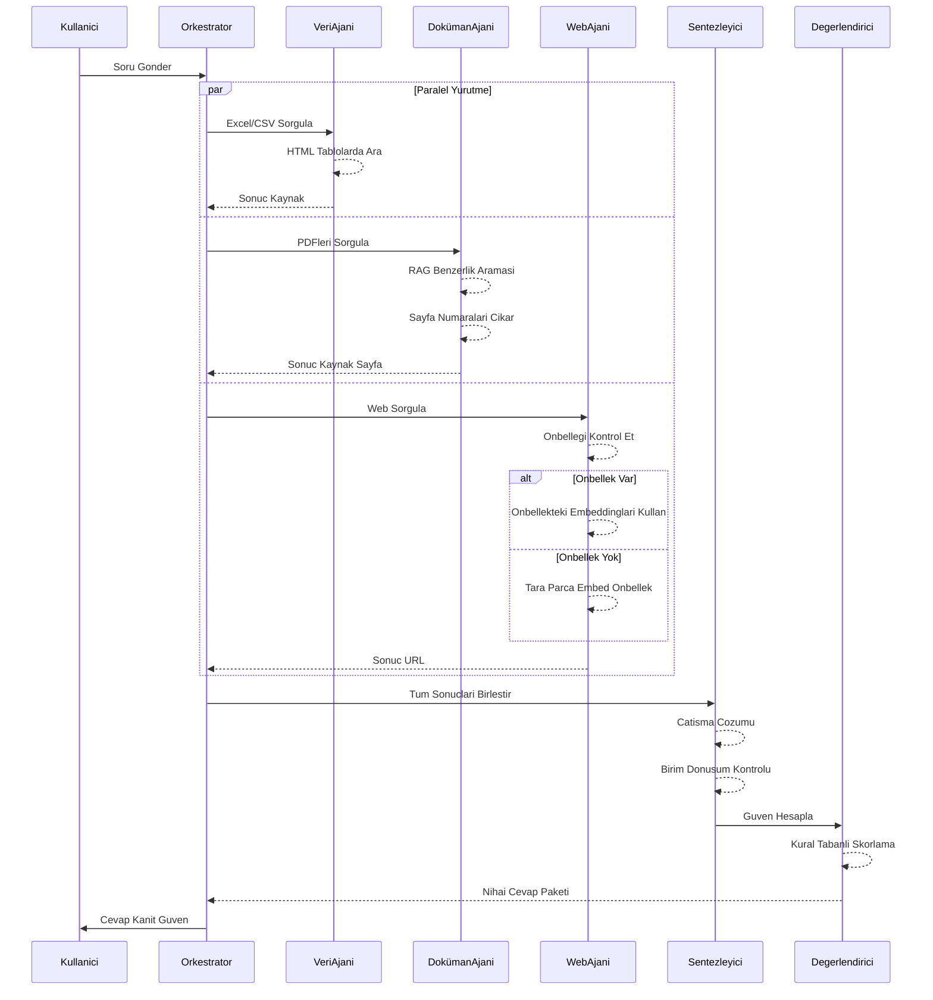
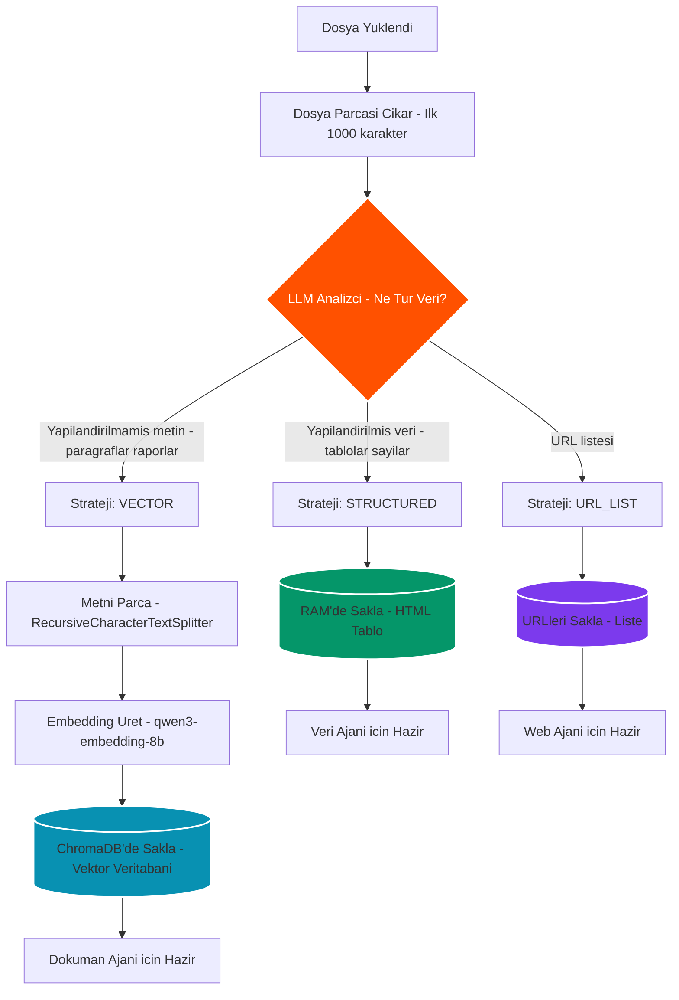
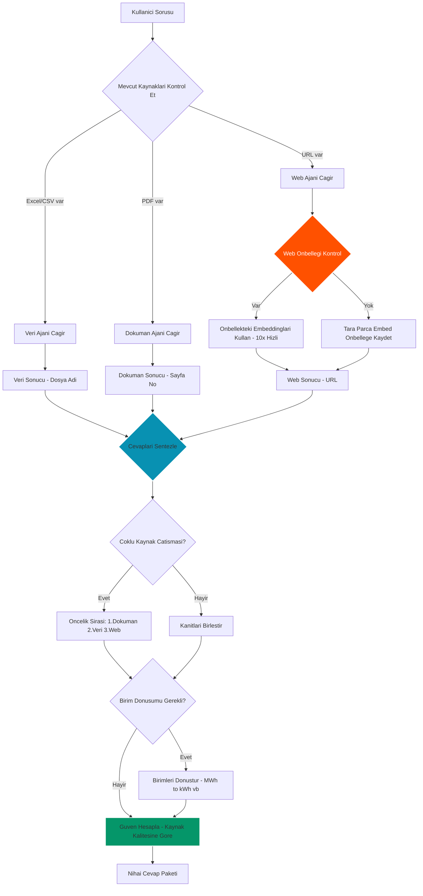
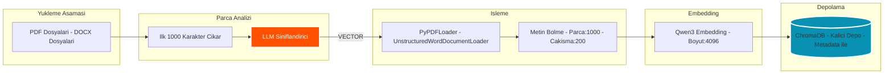
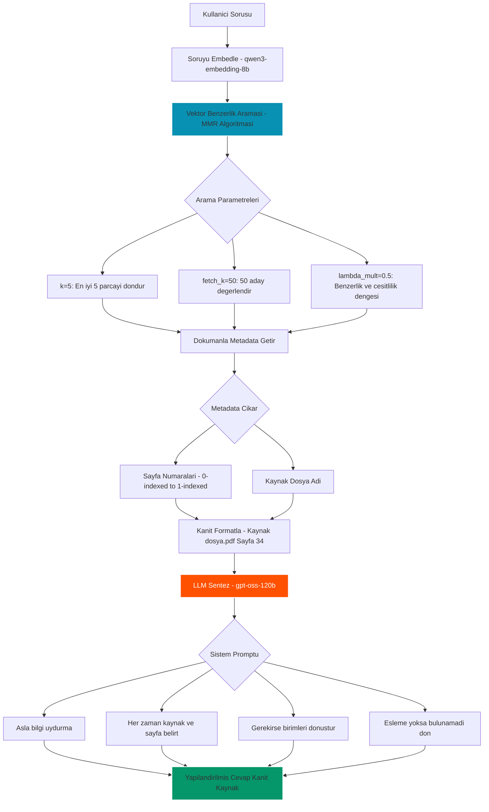
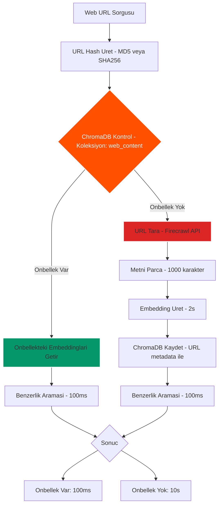

# FinSage 🏢

> **Yapay Zeka Destekli ESG Form Oto-Doldurma Sistemi** - Gelişmiş agentic mimari kullanarak çoklu kaynaktan akıllı veri çıkarımı ve form otomasyonu

FinSage, sürdürülebilirlik ve ESG anketlerini otomatik olarak dolduran gelişmiş bir yapay zeka sistemidir. Excel/CSV verileri, PDF raporları ve web sayfaları gibi birden fazla kaynaktan bilgi çıkarır. Paralel işleme ve yüksek doğruluk için çoklu ajan mimarisi ile inşa edilmiştir.

---

## ✨ Öne Çıkan Özellikler

### 🤖 Çoklu Ajan Mimarisi
- **Veri Ajanı**: Yapılandırılmış verileri (Excel, CSV) akıllı birim dönüşümü ile analiz eder
- **Doküman Ajanı**: RAG (Retrieval Augmented Generation) kullanarak PDF'lerden bilgi çıkarır
- **Web Tarayıcı Ajanı**: ChromaDB tabanlı kalıcı önbellekleme ile web içeriği getirir ve analiz eder
- **Değerlendirici Ajan**: Kaynak kalitesi ve veri tamlığına dayalı güven skoru hesaplar

### ⚡ Yüksek Performans
- **Paralel İşleme**: ThreadPoolExecutor ile aynı anda birden fazla soruyu işler (5 worker)
- **Akıllı Önbellekleme**: Web içeriği için ChromaDB tabanlı kalıcı önbellek (~10x hızlanma)
- **Gerçek Zamanlı Metrikler**: İşleme süresi, soru başına istatistikler ve paralel kazançları takip eder
- **Asenkron Operasyonlar**: Canlı ilerleme göstergeleri ile bloke olmayan arayüz

### 🎨 Premium Arayüz
- **Koyu Tema**: Glassmorphism ile güzel KKB markalı koyu mod arayüzü
- **Canlı İlerleme**: Analiz sırasında gerçek zamanlı ilerleme çubukları ve durum güncellemeleri
- **Performans Panosu**: Tamamlandıktan sonra detaylı zamanlama istatistikleri ve hızlanma metrikleri
- **Kanıt Gösterimi**: Tam şeffaflık için AI güveni, kaynaklar, kanıt metni ve sayfa numaraları gösterir

### 🔍 Akıllı Özellikler
- **LLM Tabanlı Kaynak Tespiti**: Otomatik dosya tipi tespiti ve yönlendirme stratejisi
- **Otomatik Birim Dönüşümü**: Akıllı dönüşüm (MWh→kWh, ton→kg, m³→litre, GJ→kWh)
- **Çoklu Seçim Desteği**: Tek seçimli, çoklu seçimli ve açık metin sorularını işler
- **Kaynak Atıfları**: Her zaman dosya adları ve sayfa numaraları ile kaynakları gösterir
- **Yedek Mekanizmalar**: Yerel veri yetersiz olduğunda web yedekli çok katmanlı arama

---

## 📁 Modüler Kod Yapısı

Proje, net sorumluluk ayrımı ile temiz, modüler bir mimari takip eder:

```
finsage/
├── app.py                          # Ana Streamlit uygulaması ve orkestrasyon
├── main.py                         # CLI giriş noktası (Streamlit alternatifi)
│
├── agents/                         # 🤖 Uzmanlaşmış Yapay Zeka Ajanları
│   ├── __init__.py
│   ├── data_agent.py              # Excel/CSV yapılandırılmış veri analizcisi
│   ├── doc_agent.py               # PDF doküman RAG ajanı (LangChain)
│   ├── web_scraper.py             # Firecrawl + ChromaDB önbellek ile web tarama
│   ├── web_scraper_bs4.py         # BeautifulSoup4 yedek tarayıcı
│   ├── web_scraper_playwright.py  # Playwright yedek tarayıcı
│   ├── web_scraper_trafilatura.py # Trafilatura yedek tarayıcı
│   └── evaluator.py               # Cevap güven değerlendirme mantığı
│
├── core/                          # ⚙️ Çekirdek Konfigürasyon ve Yardımcılar
│   ├── __init__.py
│   ├── config.py                  # LLM, embedding modelleri ve uygulama ayarları
│   ├── logger.py                  # Merkezi loglama kurulumu
│   └── unit_converter.py          # Birim dönüşüm mantığı ve doğrulama
│
├── ingestion/                     # 📥 Veri Alım Pipeline'ı
│   ├── __init__.py
│   └── processor.py               # LLM tabanlı dosya yönlendirme ve depolama
│
├── utils/                         # 🛠️ Yardımcı Fonksiyonlar
│   ├── __init__.py
│   ├── validators.py              # Girdi doğrulama ve temizleme
│   └── math_tool.py               # Ajanlar için matematiksel işlemler
│
├── data/                          # 📂 Veri Depolama
│   └── chroma_db/                 # ChromaDB vektör veritabanı (PDF + web önbellek)
│
├── logs/                          # 📝 Uygulama Logları
│   └── finsage_YYYYMMDD.log
│
├── tests/                         # 🧪 Test Dosyaları
│   └── ...                        # Çeşitli test scriptleri ve çıktıları
│
├── requirements.txt               # Python bağımlılıkları
├── .env                          # Ortam değişkenleri (API anahtarları)
└── README.md                     # Bu dosya
```

### Modül Sorumlulukları

#### **`app.py`** - Ana Uygulama
- Streamlit UI başlatma ve düzen
- Dosya yükleme ve URL yönetimi
- Soru seti yükleme (JSON)
- Paralel soru işleme orkestrasyonu
- Performans metrik takibi
- Cevap sentezi ve gösterimi
- Form gönderimi ve dışa aktarma

#### **`agents/`** - Uzmanlaşmış AI Ajanları
Her ajan belirli bir veri kaynağı için tasarlanmıştır:

- **`data_agent.py`**: RAM'de HTML tabloları olarak saklanan yapılandırılmış verileri okur
- **`doc_agent.py`**: ChromaDB vektör deposu kullanarak RAG tabanlı PDF doküman araması
- **`web_scraper.py`**: Firecrawl API ve kalıcı önbellekleme ile web içerik çıkarımı
- **`evaluator.py`**: Kaynak kalitesine dayalı kural tabanlı güven skorlaması (0-100)

#### **`ingestion/processor.py`** - Akıllı Dosya Yönlendirici
- **LLM tabanlı karar verme**: Optimal işleme stratejisini belirlemek için dosya parçalarını analiz eder
- Dosyaları şuraya yönlendirir: `STRUCTURED` (RAM), `VECTOR` (ChromaDB), veya `URL_LIST` (web linkleri)
- Kaynak takibi ile tekrarlayan işlemleri önler
- PDF, DOCX, Excel, CSV ve metin dosyalarını işler

#### **`core/`** - Konfigürasyon Katmanı
- **`config.py`**: Merkezi LLM ayarları (KLOUDEKS/OpenAI), embedding modelleri, yollar
- **`logger.py`**: Dosya rotasyonu ile yapılandırılmış loglama
- **`unit_converter.py`**: Enerji, emisyon, hacim ve kütle birim dönüşümleri

---

## 🏗️ Genel Sistem Mimarisi

### Üst Seviye Sistem Tasarımı

```mermaid
graph TB
    subgraph "Kullanici Arayuzu"
        UI[Streamlit UI - Koyu Tema]
        UPLOAD[Dosya Yukleme]
        URLS[Manuel URLler]
        JSON[Soru Seti JSON]
    end
    
    subgraph "Alim Katmani"
        ROUTER[LLM Tabanli Router - processor.py]
        ROUTER -->|STRUCTURED| RAM[(RAM Depo - HTML Tablolar)]
        ROUTER -->|VECTOR| VECT[(ChromaDB - Vektor Depo)]
        ROUTER -->|URL_LIST| URLS_STORE[(URL Depo - Liste)]
    end
    
    subgraph "Ajan Katmani"
        DATA[Veri Ajani - Excel/CSV]
        DOC[Dokuman Ajani - PDF RAG]
        WEB[Web Tarayici - Firecrawl Onbellek]
    end
    
    subgraph "Isleme Katmani"
        SYNTH[Cevap Sentezleyici - Coklu Kaynak Birlestirme]
        CONV[Birim Donusturucu - MWh to kWh vb.]
        EVAL[Guven Degerlendirici - Kural Tabanli Skorlama]
    end
    
    subgraph "Depolama"
        RAM
        VECT
        URLS_STORE
        CACHE[(ChromaDB Web Onbellek - URL to Embeddings)]
    end
    
    UI --> UPLOAD
    UI --> URLS
    UI --> JSON
    
    UPLOAD --> ROUTER
    URLS --> URLS_STORE
    JSON --> PARALLEL[Paralel Yurutucu - ThreadPoolExecutor]
    
    PARALLEL --> DATA
    PARALLEL --> DOC
    PARALLEL --> WEB
    
    DATA --> RAM
    DOC --> VECT
    WEB --> URLS_STORE
    WEB --> CACHE
    
    DATA --> SYNTH
    DOC --> SYNTH
    WEB --> SYNTH
    
    SYNTH --> CONV
    CONV --> EVAL
    EVAL --> RESULT[Nihai Cevap - Guven - Kanit]
    
    RESULT --> UI
    
    style UI fill:#1e293b,stroke:#FF5100,stroke-width:3px
    style ROUTER fill:#334155,stroke:#FF5100,stroke-width:2px
    style SYNTH fill:#334155,stroke:#FF5100,stroke-width:2px
    style RESULT fill:#059669,stroke:#10b981,stroke-width:2px
```



---

## 🤖 Agentic Mimari: Karar Verme ve Görev İşleme

### Çoklu Ajan Koordinasyon Akışı

Sistem, her ajanın belirli bir veri kaynağında uzmanlaştığı **hiyerarşik çoklu ajan mimarisi** kullanır. Orkestratör (`solve_question_autofill` fonksiyonu) tüm ajanları koordine eder ve yanıtlarını sentezler.



### Ajan Karar Verme Süreci

#### 1. **Alım Yönlendirici Kararı (LLM Tabanlı)**

Bir dosya yüklendiğinde, `processor.py` modülü bir parçayı analiz etmek ve işleme stratejisine karar vermek için LLM kullanır:



**LLM Prompt (Basitleştirilmiş):**
```
Dosya türü sınıflandırıcısısın. Bu dosya parçasını analiz et ve belirle:
- STRUCTURED: Tablolar, CSV verisi veya yapılandırılmış sayısal veri içeriyorsa
- VECTOR: Yapılandırılmamış metin (raporlar, dokümanlar, paragraflar) içeriyorsa
- URL_LIST: Web URL listesi içeriyorsa

Dosya: {file_name}
Parça: {snippet}

Çıktı: SADECE bir kelime: STRUCTURED, VECTOR, veya URL_LIST
```

#### 2. **Soru İşleme Karar Ağacı**

Her soru için, orkestratör veri kullanılabilirliğine göre hangi ajanları çağıracağına karar verir:



#### 3. **Cevap Sentez Mantığı**

`synthesize_strict_answer` fonksiyonu birden fazla ajandan gelen sonuçları birleştirir:

**Öncelik Kuralları:**
1. **Doküman Ajanı** (en yüksek öncelik): Dahili şirket raporları en güvenilirdir
2. **Veri Ajanı**: Excel/CSV'den yapılandırılmış veri
3. **Web Ajanı** (en düşük öncelik): Harici web kaynakları yedek olarak kullanılır

**Çatışma Çözümü:**
- Kaynaklar anlaşmazsa, daha yüksek öncelikli kaynak kullanılır
- Şeffaflık için tüm kaynaklar kanıt bölümünde gösterilir
- Karşılaştırmadan önce birim dönüşümleri uygulanır

---

## 🔄 Doküman Okuma Süreci ve RAG Pipeline

### Doküman Alım Pipeline'ı



### RAG Sorgu Akışı (Doküman Ajanı)

Bir soru sorulduğunda, Doküman Ajanı şu adımları gerçekleştirir:



**Temel RAG Konfigürasyonu:**
- **Embedding Modeli**: `qwen3-embedding-8b` (4096 boyut)
- **Arama Algoritması**: MMR (Maksimum Marjinal İlgililik) çeşitlilik için
- **Parça Boyutu**: 1000 karakter, 200 karakter çakışma ile
- **Getirme Sayısı**: 50 adaydan en ilgili 5 parça

**Metadata Koruma:**
```python
# PyPDFLoader otomatik olarak metadata ekler:
{
    "page": 33,  # 0-indexed sayfa numarası
    "source": "/path/to/report.pdf"
}

# Doküman Ajanı kullanıcı dostu formata çevirir:
"150 MWh enerji tüketimi (Kaynak: Surdurulebilirlik_Raporu.pdf, Sayfa 34)"
```

---

## 📊 Performans Optimizasyon Stratejisi

### Paralel İşleme Mimarisi


**Konfigürasyon:**
```python
# core/config.py
class AppConfig:
    MAX_PARALLEL_WORKERS = 5      # Eşzamanlı thread sayısı
    AGENT_TIMEOUT_SECONDS = 60    # Soru başına timeout
```

**Beklenen Performans:**
- **Seri İşleme**: 25 soru × 9s ortalama = 225 saniye
- **Paralel İşleme**: 25 soru ÷ 5 worker = ~45 saniye
- **Hızlanma**: Paralelleştirme ile ~%400 daha hızlı

### Web Tarama Önbellek Stratejisi



**Önbellek Avantajları:**
- **İlk Sorgu**: ~10 saniye (tarama + parçalama + embedding + kaydetme)
- **Sonraki Sorgular**: ~100ms (doğrudan embedding araması)
- **Hızlanma**: Tekrarlanan URL'lerde ~100x daha hızlı
- **Depolama**: ChromaDB koleksiyonu `web_content` - `data/chroma_db/` içinde

---

## 🚀 Hızlı Başlangıç

### Gereksinimler
- Python 3.11+
- KLOUDEKS API anahtarı (veya OpenAI-uyumlu endpoint)
- Firecrawl API anahtarı (web tarama için)

### Kurulum

1. **Depoyu klonlayın**
```bash
git clone <repo-url>
cd finsage
```

2. **Bağımlılıkları yükleyin**
```bash
pip install -r requirements.txt
```

3. **Ortamı yapılandırın**

Bir `.env` dosyası oluşturun:
```env
# LLM & Embedding API
MIA_API_KEY=kloudeks_api_anahtariniz
MIA_BASE_URL=https://mia.csp.kloudeks.com/v1

# Web Scraper API
FIRECRAWL_API_KEY=firecrawl_api_anahtariniz
```

4. **Uygulamayı çalıştırın**
```bash
streamlit run app.py
```

Uygulama `http://localhost:8501` adresinde açılacaktır

---

## 📖 Kullanım Kılavuzu

### 1. Veri Kaynaklarını Yükleyin

**Kenar Çubuğu Seçenekleri:**
- **Rapor Yükle**: PDF dokümanlar, Word dosyaları, Excel sayfaları, CSV dosyaları
  - PDF/DOCX → Vektör veritabanına (ChromaDB) işlenir
  - Excel/CSV → HTML tablolarına dönüştürülür ve RAM'de saklanır
- **Web URL Ekle**: URL eklemek için "🌐 Web Tarama Ayarları"na tıklayın
  - Bağlantılı sayfaları özyinelemeli taramak için "Tarama Modu"nu aktifleştirin
  - Derinlik (1-5 seviye) ve sayfa limiti (5-50 sayfa) yapılandırın

### 2. Soru Setini Yükleyin

- Sorularınızı içeren bir JSON dosyası yükleyin
- Format örneği:
```json
{
  "formId": "123",
  "questions": [
    {
      "questionId": 1,
      "questionDescription": "2023 yılında toplam enerji tüketimi kaç kWh?",
      "questionType": "openText",
      "answers": []
    },
    {
      "questionId": 2,
      "questionDescription": "ISO 14001 sertifikasına sahip misiniz?",
      "questionType": "singleChoice",
      "answers": [
        {"answerId": 1, "answerDescription": "Evet"},
        {"answerId": 2, "answerDescription": "Hayır"}
      ]
    }
  ]
}
```

### 3. Cevapları Oluşturun

**"✨ Yapay Zeka ile Formu Doldur"** butonuna tıklayın

Sistem:
1. ✅ Soruları paralel işler (5 worker)
2. 📊 Canlı güncellemelerle gerçek zamanlı ilerleme gösterir
3. ⏱️ Tamamlandıktan sonra performans metriklerini gösterir
4. 📝 Formu AI üretimi cevaplar + kanıtlarla doldurur

**Performans Gösterimi:**
```
📊 SORU CEVAPLAMA PERFORMANS RAPORU
⏱️ Gerçek Toplam Süre: 45.2s (butona basıştan itibaren)
📝 Toplam Soru: 25
⚡ Soru Süreleri Toplamı: 3d 45s (225s)
📊 Ortalama Süre/Soru: 9.0s
🚀 En Hızlı: 2.1s
🐌 En Yavaş: 23.4s
⚡ Paralel Kazanç: %397 daha hızlı
```

### 4. İnceleyin & Gönderin

- Güven skorlarıyla (0-100) AI önerilerini inceleyin
- Kanıt ve kaynak atıflarını kontrol edin
- Gerekirse cevapları manuel olarak ayarlayın
- **"✅ Formu Onayla ve Kaydet"** butonuna tıklayın
- Sonuçları JSON olarak indirin

**Güven Göstergeleri:**
- 🟢 **70-100**: Yüksek güven (güvenilir kaynaklardan güçlü kanıt)
- 🟡 **40-69**: Orta güven (kısmi kanıt veya harici kaynaklar)
- 🔴 **0-39**: Düşük güven (zayıf veya çelişkili kanıt)

---

## ⚙️ Konfigürasyon Seçenekleri

### `core/config.py`

```python
class AppConfig:
    # Performans Ayarları
    MAX_PARALLEL_WORKERS = 5           # Eşzamanlı soru işleme
    AGENT_TIMEOUT_SECONDS = 60         # Soru başına timeout
    
    # Getirme Ayarları
    DOC_RETRIEVAL_K = 5                # Getirilecek parça sayısı
    MIN_DOC_RESPONSE_LENGTH = 50       # Minimum geçerli doküman yanıtı
    MIN_DATA_RESPONSE_LENGTH = 20      # Minimum geçerli veri yanıtı
    
    # İçerik Limitleri
    WEB_CONTENT_MAX_CHARS = 40000      # İşlenecek maksimum web içeriği
    SNIPPET_MAX_CHARS = 1000           # LLM analizi için dosya parçası
    
    # Güven Eşikleri
    HIGH_CONFIDENCE_THRESHOLD = 70     # Yeşil gösterge
    MEDIUM_CONFIDENCE_THRESHOLD = 40   # Sarı gösterge
    LOW_CONFIDENCE_THRESHOLD = 0       # Kırmızı gösterge
```

### LLM Modelleri

```python
# Embedding Modeli (4096 boyut)
embedding_model = OpenAIEmbeddings(
    model="qwen3-embedding-8b",
    openai_api_key=API_KEY,
    openai_api_base=KLOUDEKS_BASE_URL
)

# Muhakeme LLM (120B parametreler)
llm_reasoning = ChatOpenAI(
    model="gpt-oss-120b",
    openai_api_key=API_KEY,
    openai_api_base=KLOUDEKS_BASE_URL,
    temperature=0,      # Denetim için deterministik
    max_tokens=4000     # Uzun form cevaplar
)
```

### Web Tarayıcı Ayarları

- **Tarama Modu**: Hedef sayfalardaki linkleri takip et (boolean)
- **Maksimum Derinlik**: Ne kadar derin taranacağı (1-5)
- **Sayfa Limiti**: URL başına maksimum taranacak sayfa (5-50)

---

## 🧪 Test

Uçtan uca testleri çalıştırın:
```bash
python -m pytest tests/test_end_to_end.py -v
```

Tek tek bileşenleri test edin:
```bash
python -m pytest tests/test_web_scraper.py -v
python -m pytest tests/test_cache.py -v
python -m pytest tests/test_agents.py -v
```

---

## 📝 Loglama

Loglar günlük rotasyon ile `logs/finsage_YYYYMMDD.log` dosyasına yazılır.

**Log Seviyeleri:**
- **INFO**: İşleme adımları, zamanlama, başarılı operasyonlar
- **WARNING**: Kritik olmayan sorunlar (ör. eksik metadata)
- **ERROR**: Dikkat gerektiren hatalar (ör. API hataları)

Gerçek zamanlı logları görüntüleyin:
```bash
# Linux/Mac
tail -f logs/finsage_$(date +%Y%m%d).log

# Windows PowerShell
Get-Content logs/finsage_$(Get-Date -Format "yyyyMMdd").log -Wait
```

---

## 🛠️ Sorun Giderme

### Yaygın Sorunlar

**1. ChromaDB İçe Aktarma Hatası**
```bash
pip install --upgrade chromadb
```

**2. API Anahtarı Hataları**
- `.env` dosyasının `MIA_API_KEY` ve `FIRECRAWL_API_KEY` içerdiğini doğrulayın
- API anahtarı geçerliliğini ve kotasını kontrol edin

**3. Büyük Dosyalarla Bellek Sorunları**
- `ingestion/processor.py` içinde parça boyutunu artırın
- `core/config.py` içinde `MAX_PARALLEL_WORKERS` değerini azaltın
- Aynı anda daha az PDF işleyin

**4. Timeout Hataları**
- `core/config.py` içinde `AGENT_TIMEOUT_SECONDS` değerini artırın
- Web tarama derinliği/limitini azaltın
- Web tarama için internet bağlantısını kontrol edin

**5. Birim Dönüşüm Hataları**
- Desteklenen dönüşümler için `core/unit_converter.py` dosyasını inceleyin
- Belirli dönüşüm hataları için logları kontrol edin
- Girdi veri formatını doğrulayın

---

## 🤝 Katkıda Bulunma

1. Depoyu fork edin
2. Bir özellik dalı oluşturun (`git checkout -b feature/harika-ozellik`)
3. Değişiklikleri commit edin (`git commit -m 'Harika özellik ekle'`)
4. Dala push edin (`git push origin feature/harika-ozellik`)
5. Bir Pull Request açın

**Kodlama Standartları:**
- Python kodu için PEP 8'i takip edin
- Tüm fonksiyonlara docstring ekleyin
- Mimari değişiklikler için README'yi güncelleyin
- Yeni özellikler için testler ekleyin

---

## 📄 Lisans

Bu proje özel ve gizlidir.

---

## 🙏 Teşekkürler

- **LangChain**: Ajan framework'ü ve RAG implementasyonu
- **Streamlit**: Güzel reaktif UI framework'ü
- **ChromaDB**: Yüksek performanslı vektör veritabanı
- **Firecrawl**: Güvenilir web tarama API'si
- **KLOUDEKS**: LLM ve embedding altyapısı

---

## 📧 İletişim

Sorular veya destek için lütfen KKB Greendeks geliştirme ekibi ile iletişime geçin.

---

**❤️ ile KKB Greendeks için geliştirildi**

*Son Güncelleme: Aralık 2025*
